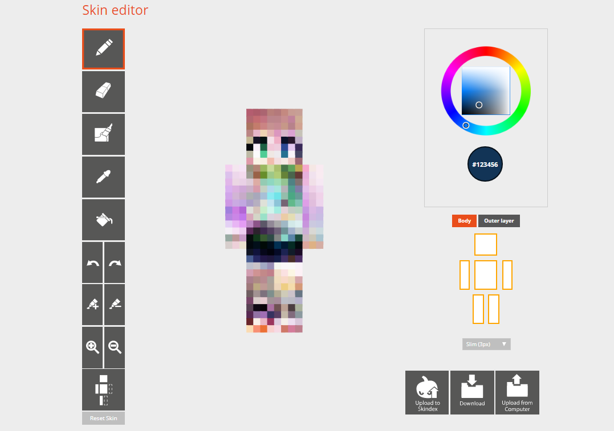
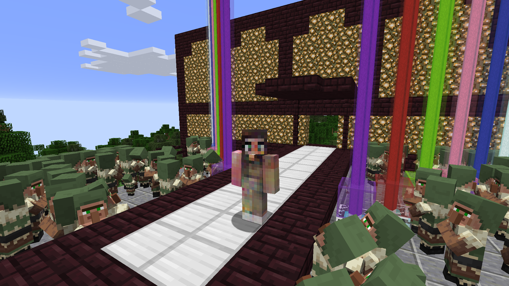
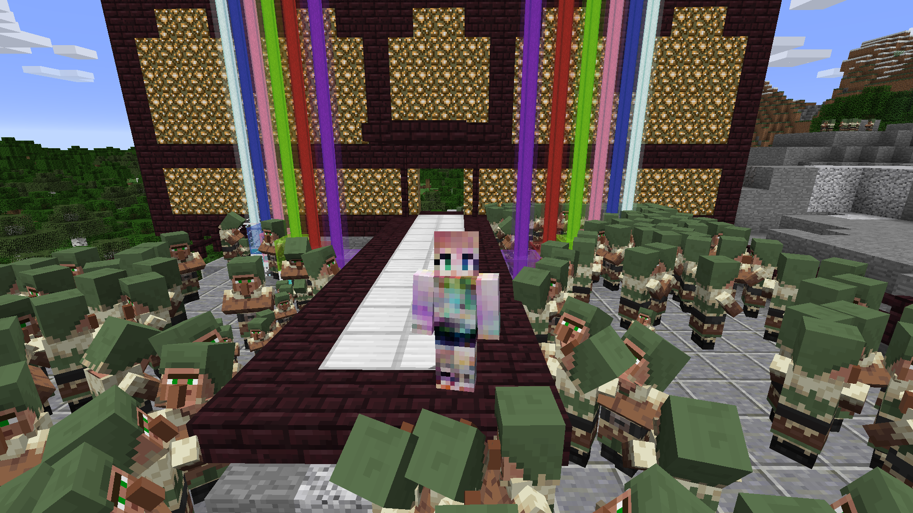
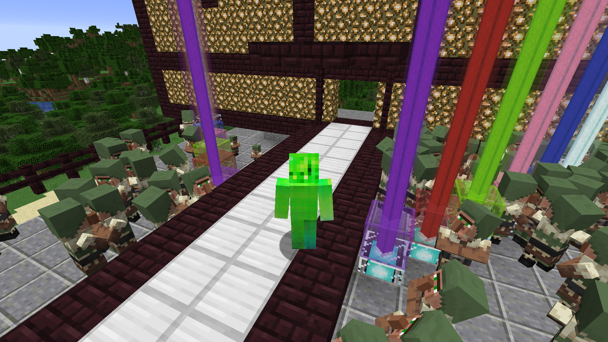
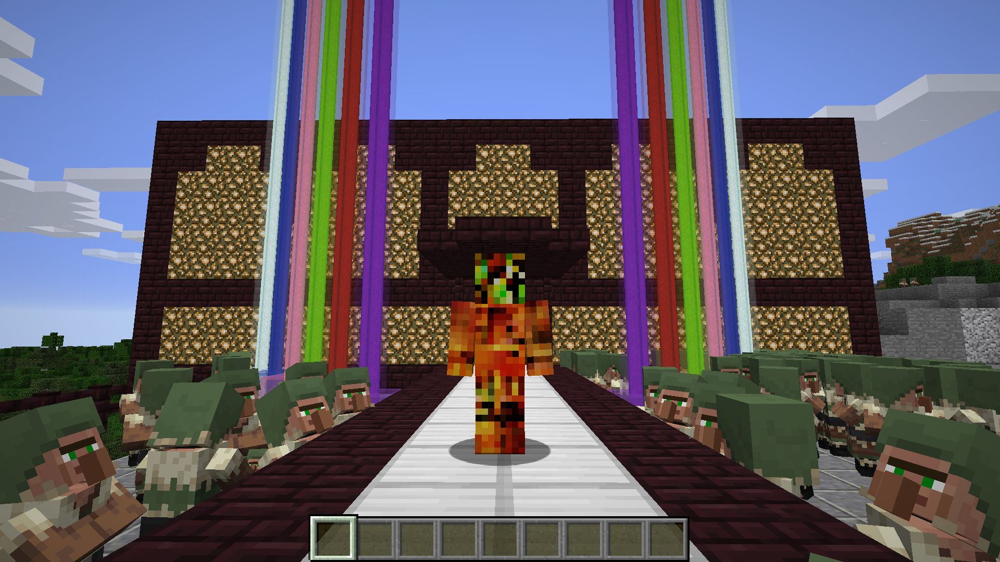
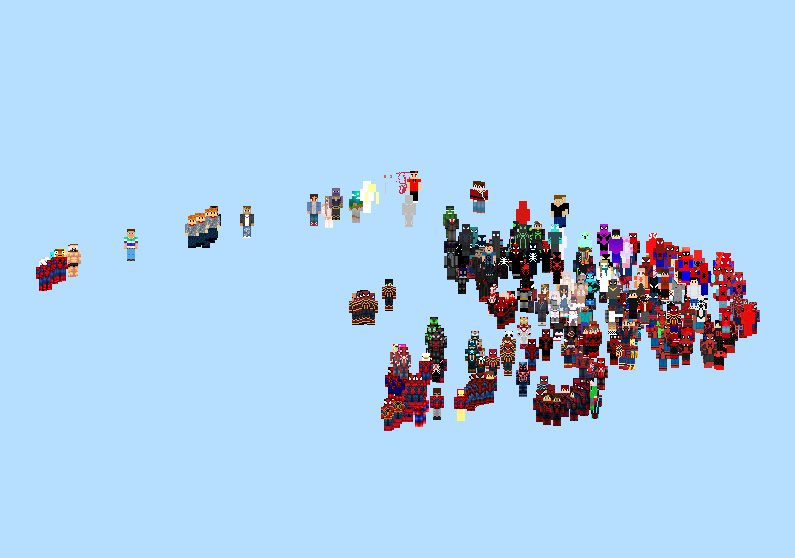
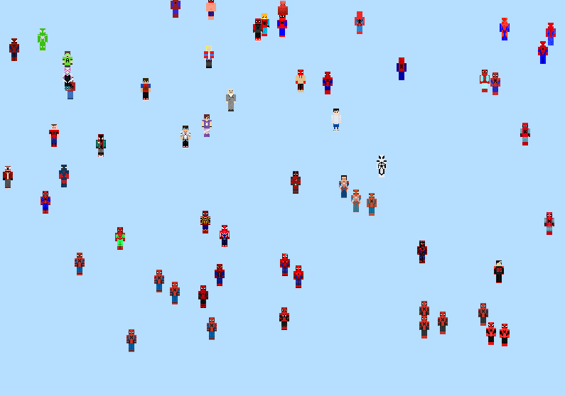
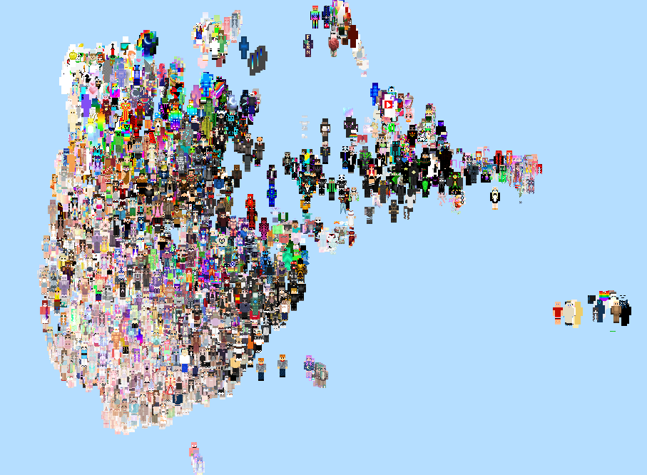
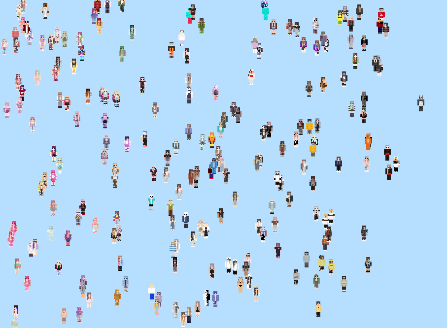

### Menu

[Methodology](pages/methodology.html) <t> [Data](pages/data.html) <t> [Visuals](pages/visuals.html) <t> [Results](pages/results.html) <t> [Looking Forward](pages/looking_forward.html) <t> [Appendix](pages/references.html)

  

### Background
Minecraft, a creative sandbox-like computer game, allows players to explore their personalized randomly generated world in which they can harvest resources, build structures, and craft new items. Each player model is wrapped using a flattened "skin" which can either be downloaded from the internet or custom build using one of the many online editors.  

Online Skin Editor | Minecraft Player (in-game)
:---:|:---:
 | 

  
In this project I attempt the following objectives:
1. Visualize the sample of skins as clusters using associated tags
2. Use the sample of skins and a DCGAN to generate new samples of Minecraft skins   

### DCGAN Training
A sample of roughly 2800 skins were downloaded from https://www.minecraftskins.com/ and stored locally as PNG files. Using PyTorch's example DCGAN implementation, I trained the Generator and Discriminator networks using the sample of skins until the resulting outputs seemed reasonable. This process took roughly 180 epochs although the DCGAN was able to produce cohesive results within the first 50 epochs.   

    
DCGAN Training Progress

    

 

Using the generated skins, I mapped each one on top of a Minecraft player model in order to visualize the results. Here are a few of the samples produced:

    
    

    
    

 

### Dimensionality Reduction
For the second portion of my objective, each skin was converted into a feature vector and reduced into 2 dimensions so that a comprehensible plot could be produced. My objective was to observe whether these skins, when reduced from thousand of dimensions into 2, preserved any sort of clusterable structure. The image feature extraction process utilized the VGG16 convolution neural network, a pre-trained network that was trained using roughly 1.2 million images.  

Below is a visual showing all 348 (including 10 randomly selected) Minecraft skins after dimensionality reduction. There are some clear clusters present since many of these skins are either exactly the same or very close in composition. This smaller data set served as a proof of concept before attempting to visualize the entire 2,800 large data set.

    
Spiderman Skins

    
    

    
All Skins

    
    

 

The below plot was created using only skins that had at least 1 tag and a most popular tag that was part of the subset of top N tags (where N can be changed depending on preference). For example, if out of the top 20 most popular tags the first tag was "girl", then I would not include skins which had their most popular skin recorded with a tag of "girl".  

    
Dimensionality Reduction on Skins With Popular Tag as Label

      

