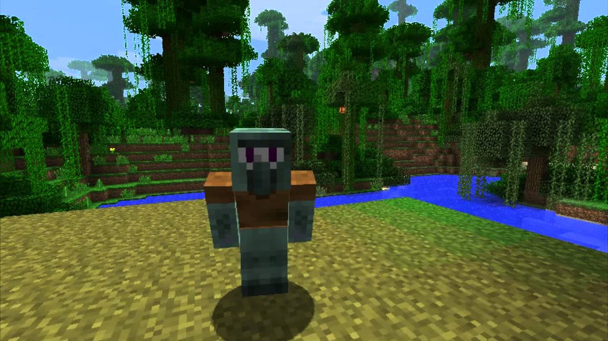
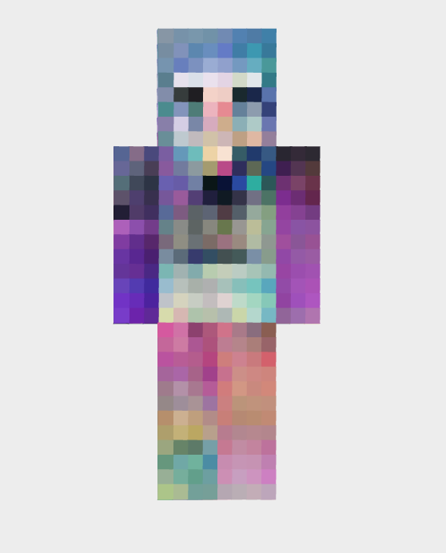
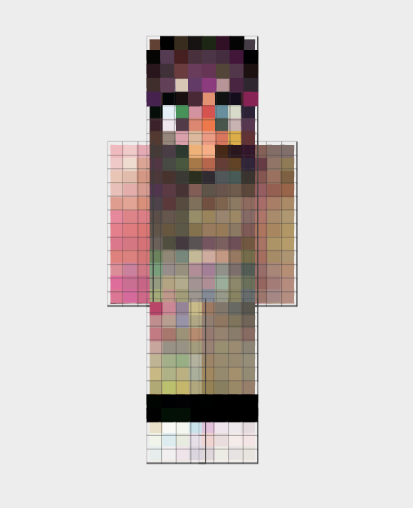
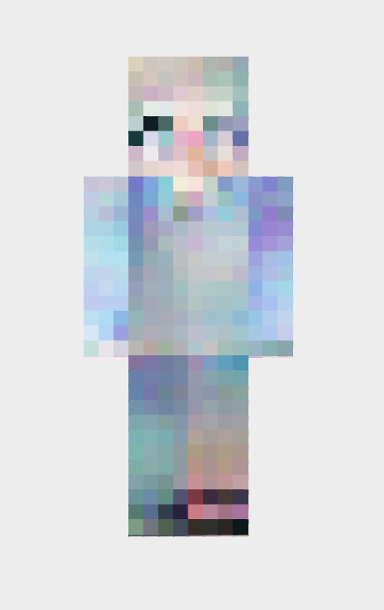
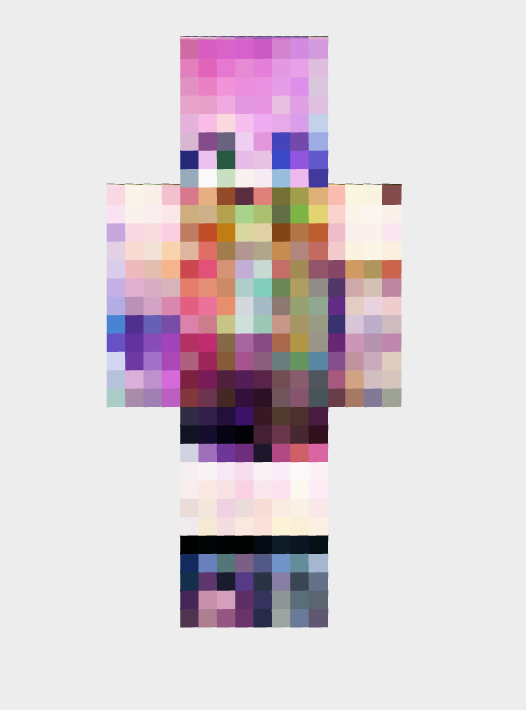
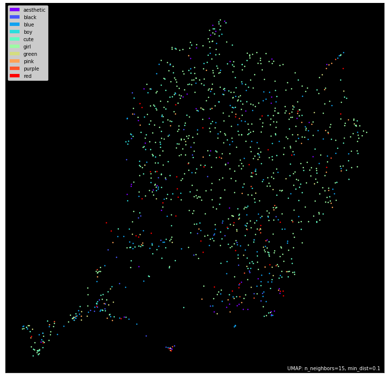

### Menu
- [Methodology](pages/methodology.html)
- [Data](pages/data.html)
- [Visuals](pages/visuals.html)
- [Results](pages/results.html)
- [Looking Forward](pages/looking_forward.html)
- [References](pages/references.html)

### Overview
Minecraft, a creative sandbox-like computer game, allows players to explore their personalized randomly generated world in which they can harvest resources, build structures, and craft new items. Each player model is wrapped using a flattened "skin" which can either be downloaded from the internet or custom build using one of the many online editors.  

      
      

In this project I attempt the following objectives:
1. Visualize the sample of skins as clusters using associated tags
2. Use the sample of skins and a DCGAN to generate new samples of Minecraft skins  

A sample of roughly 2800 skins were downloaded from https://www.minecraftskins.com/ and stored locally as PNG files. Using PyTorch's example DCGAN implementation, I trained the Generator and Discriminator networks using the sample of skins until the resulting outputs seemed reasonable. This process took roughly 180 epochs although the DCGAN was able to produce cohesive results within the first 50 epochs.  

    

 

Using the generated skins, I mapped each one on top of a Minecraft player model in order to visualize the results. Here are a few of the samples produced:

    
    
    
    

 

For the second portion of my objective, each skin was converted into a feature vector and reduced into 2 dimensions so that a comprehensible plot could be produced. My objective was to observe whether these skins, when reduced from thousand of dimensions into 2, preserved any sort of clusterable structure. The image feature extraction process utilized the VGG16 convolution neural network, a pre-trained network that was fed 1.2 million images. The resulting array of feature vectors was then reduced using UMAP (Uniform Manifold Approximation and Projection) and displayed in a 2-D plot which is labeled by each of the point's class.  

  

