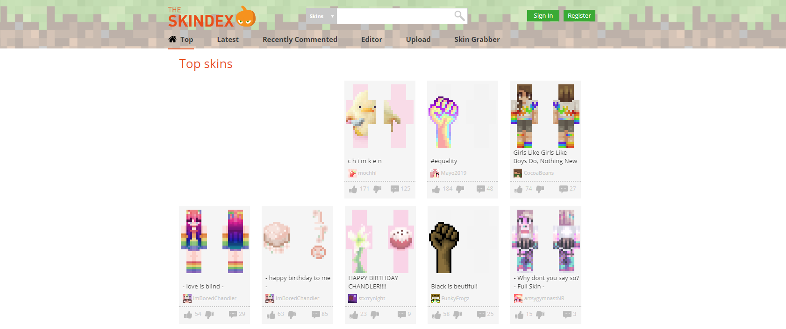
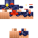
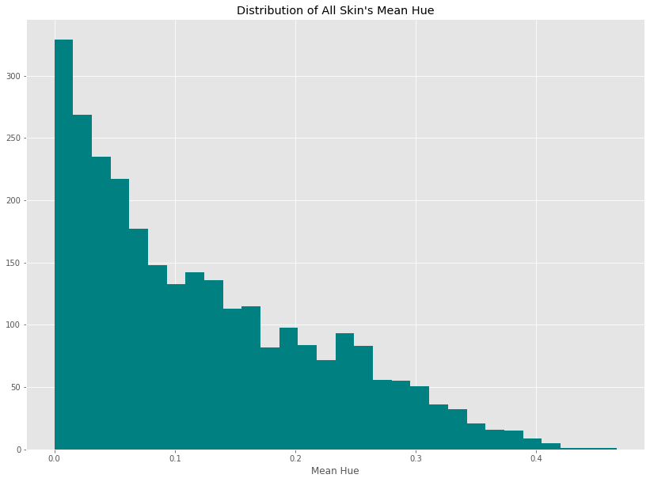

## Data Replication
All skins were gathered from the website https://www.minecraftskins.com/ which serves as a large public repository for skins across the internet. Since each player's Minecraft skin is public and associated with their username, this site allows users to either search for skins based on the player's in-game name or view a "top trending" page of skins. Since each call to gather skins was directed to the homepage of this site, all skins were gathered from the main <b>Top Trending</b> page.  

    

Several targets can be used with `run.py`. However, gathering data is accomplished using the `data` target.
* `python run.py data`  

To pull a fresh set of skins from the website, alter `data-config.json` which contains the following parameters:
> url: The main website to access skins from
> n_pages: The total number of pages to scrape (will not attempt to scrape more than available)
> search: (Optional) search term used when looking to find specific skins. Setting `"search": "spiderman"` will produce all pages of skins that result from the search query term.  

For every skin that is found, its associated image number is also used as an index when creating the dictionary of tags that is eventually written to a text file, `tags.txt`. Skins without tags are stored with an empty list as their associated tags. Each skin is stored as a PNG file with an integer as its name representing which number it came from in the batch.

> Note: Every call to `python run.py data` will clear the content of the `/data/` directory and `tags.txt`

## EDA
The first avenue that was explored in this project was the visual features of each skin. This meant going through some of the downloaded images and looking at each skin's various components. Here are some examples of the unwrapped skins:

Sample 1 | Sample 2
:---:|:---:
 | 

Through this process I started to notice that certain areas of the skin were completely greyed out (transparency set to 100%) and others were populated with intentional colorings. I then performed a small analysis on each image's data.

    
Mean Row-Wise Variance

    

    
Mean Hue

    

## Training the DCGAN

## Displaying Results
